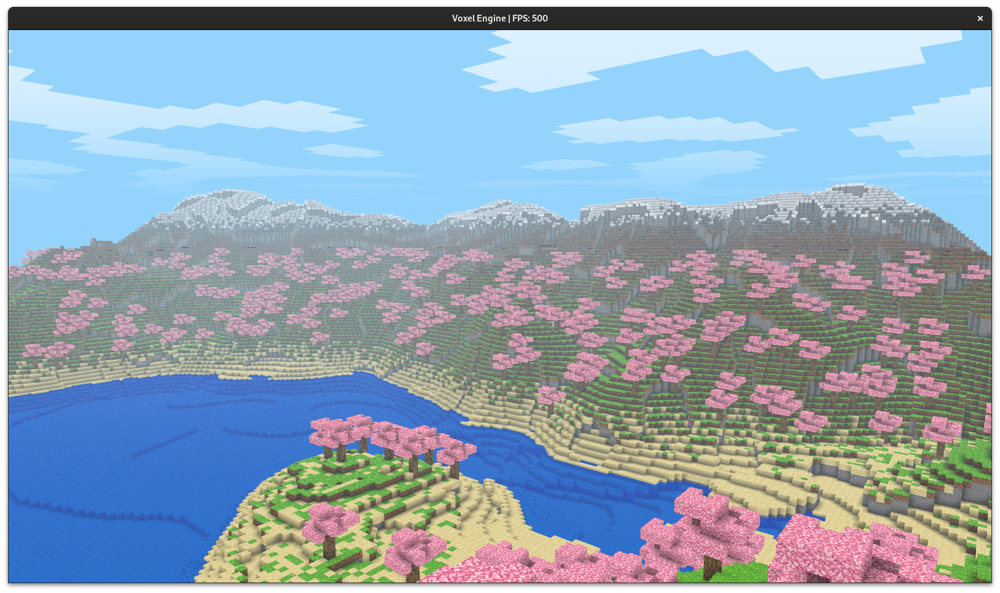

# Voxel Engine
A Minecraft like voxel engine created for Computer Graphics Project, IOE, Pulchowk Campus.


## Contributors
```
Krishant Timilsina   (078BCT045)
Bindu Paudel         (078BCT032)
```

## Screenshot


## 📃 Documentations
To play: WASDQE + Mouse


## 🔨 Build and Run

###  📋 Requirements

To set up and use the project you will need to have python:
 - [Python](https://www.python.org/)

###  ⬇️ Running the project

Clone the repository

```bash
$ git clone https://github.com/krishantt/voxel_engine.git
```


Change the working directory to the newly cloned repository:

```bash
$ cd voxel_engine
```

Create a virtual environment and activate it:

```bash
$ python3 -m venv env #or python -m venv env
$ source env/bin/activate #or env\Scripts\activate
```

Install the required dependencies:

```bash
$ pip install -r requirements.txt
```

Run the project:

```bash
$ python main.py
```
